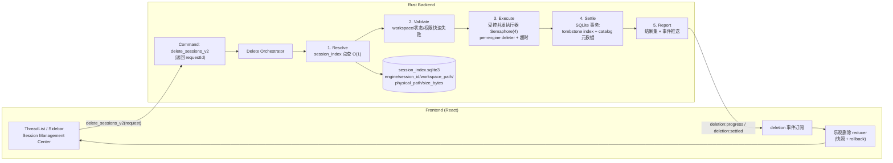
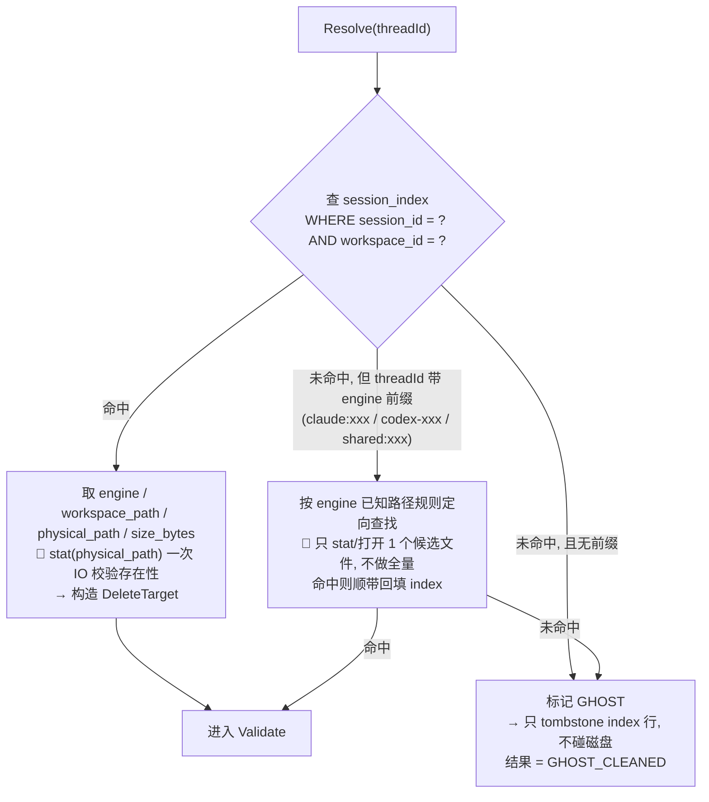
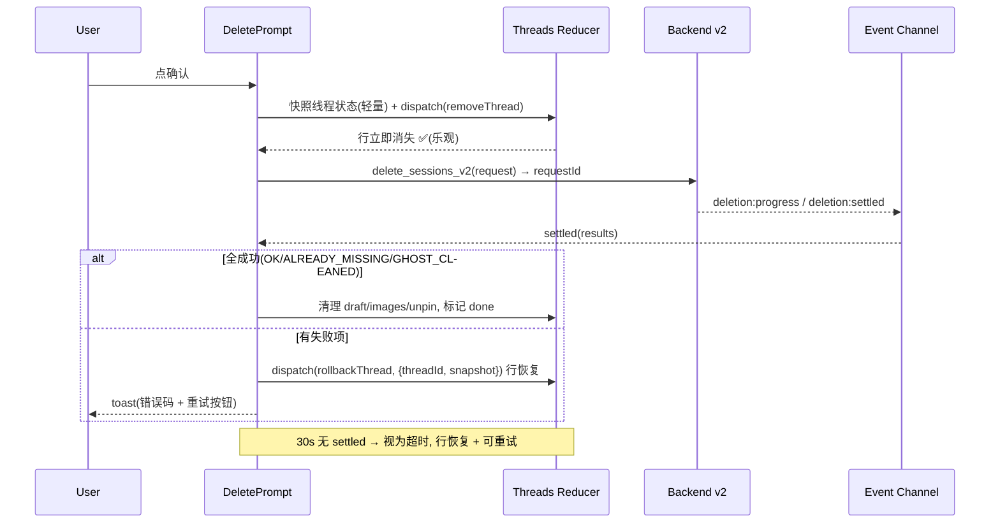

<!-- DOC-LIFECYCLE: active-plan -->
> [!IMPORTANT]
> **Lifecycle: Draft plan（待确认）。** 本文是删除会话链路（session delete）的全新架构设计，正文不引用旧实现细节作为契约。确认后需 OpenSpec 化（创建 change）才能进入 backlog 执行；未确认前不构成 active backlog。

# Session Delete 架构重设计（v2）

> **决策基线**：现有删除链路（`delete_workspace_sessions` 全量 catalog 扫描 + codex 全盘考古 + 前端长阻塞等待）整体废弃，不修修补补。以 session index 为唯一事实源，重新设计定位、执行、结算三段式协议。

## 1. 背景与问题（为什么重写）

现状三层根因（详见 `docs/analysis` 删除链路分析，结论摘要）：

1. **定位成本 O(全部会话)**：`delete_workspace_sessions_core` 每次删除都先 `build_workspace_scope_catalog_data(Exhaustive + Full + Related)`，为回答"这条会话归谁"而全量扫描所有 engine 的磁盘会话（codex 全部 jsonl + claude/gemini/kimi/grok/pi/qoder/dsh history + shared event log）。会话总量越大，单次删除越慢。
2. **codex 删除是磁盘考古**：`collect_matching_codex_session_files` 遍历所有 sessions roots 收集 jsonl，文件名匹配不上的逐个打开逐行 JSON 解析找 `session_meta.id`，再做 workspace 归属二次读文件。
3. **前端零乐观更新**：从点确认到侧栏行消失，串行等待完整后端链路；dsh daemon / opencode CLI 的网络尾巴全部计入用户等待。批量删除中被排除 engine 的会话还会串行逐条重付整个后端成本。

**关键事实（重设计抓手）**：`session_index`（SQLite）已经持久化了 `engine / session_id / workspace_path / physical_path / size_bytes / provider_profile_id` 等字段——后端手里本来就有 O(1) 定位删除文件所需的一切信息，但删除链路无视它，选择全量重扫。

## 2. 设计目标与原则

| 目标 | 验收口径 |
|---|---|
| 定位 O(1) | 删除耗时与会话总量无关；index hit 时不做任何全量扫描 |
| 前端即时反馈 | 点确认后侧栏行立刻消失（乐观删除），失败可回滚 |
| 批量恒为一次 IPC | 任何批量选择都走同一条协议，无逐条回退 |
| 幂等 | 文件已不存在 = 成功（`ALREADY_MISSING`），重试安全 |
| 可观测 | 每条删除有 requestId、进度事件、settled 结果，失败带统一错误码 |
| 不阻塞其它命令 | 重 IO 删除走受控并发执行器，不占主线程/不阻塞 UI 命令队列 |

**原则（覆盖旧设计）**：

- **Index First**：定位一律先查 session index，绝不反向全量扫描。
- **Resolve / Execute / Settle 三段分离**：定位（元数据，快）→ 执行（磁盘 IO，并发）→ 结算（index + catalog，事务）。
- **乐观提交 + 幂等结算**：前端先行、后端对账；对不上按错误码回滚。
- **幽灵会话只摘行**：index 认不出归属的会话，只 tombstone index 行，不碰磁盘。
- **删除是后台任务不是同步命令**：返回 requestId，结果走事件通道。

## 3. 目标架构总览



## 4. 删除协议（新 command 面）

### 4.1 请求

```
delete_workspace_sessions_v2 {
  workspaceId: string,
  sessionIds: Array<{
    threadId: string,          // 侧栏行 id（含 engine 前缀或 shared: 前缀）
    engine?: string,           // 冗余传，加快定位；可选
    nativeSessionId?: string,  // 冗余传，加快定位；可选
  }>,
  options?: {
    dryRun?: boolean,          // 仅定位+校验，不删除（诊断用）
  }
}
→ 立即返回 { requestId: string }
```

**关键变更**：命令**不等待删除完成**。立即返回 `requestId`，进度与结果全部经事件通道回推（见 4.3）。这消除了"弹窗 spinner 长阻塞"的体感来源。

### 4.2 结果与错误码

统一 `SessionDeleteCode`（替换旧的 `should_settle_delete_as_success` 字符串猜测）：

| code | 含义 | 前端处理 |
|---|---|---|
| `OK` | 已删除 | 保持行消失 |
| `ALREADY_MISSING` | 文件本就不存在，幂等成功 | 保持行消失 |
| `GHOST_CLEANED` | index 认不出归属，只摘行 | 保持行消失 |
| `INDEX_MISS` | index 无行 → 已降级定向查找 | 正常路径不暴露；定向也失败则报错 |
| `ENGINE_UNSUPPORTED` | 该 engine 无 deleter | toast + 行回滚 |
| `ENGINE_BUSY` | dsh daemon 等外部依赖不可用 | toast + 行回滚 + 可重试 |
| `IO_FAILED` | 磁盘删除失败（含标记失败） | toast + 行回滚 |
| `MARKED_DELETED` | 磁盘删除失败但删除标记已落（侧栏已隐藏） | 保持行消失，可选提示"后台清理中" |
| `METADATA_CLEANUP_FAILED` | index/catalog 结算失败 | toast + 行回滚 |
| `REQUEST_TIMEOUT` | 执行超时 | toast + 行回滚 + 可重试 |

幂等成功收敛为：`OK` / `ALREADY_MISSING` / `GHOST_CLEANED` / `MARKED_DELETED`。

### 4.3 事件通道

复用既有 event emit 机制（与 live channel 同级，独立 topic）：

```
deletion:progress  { requestId, done: number, total: number }
deletion:settled   { requestId, results: SessionDeleteResult[] }   // 最终对账
deletion:failed    { requestId, code, message }                    // 整体失败（罕见）
```

前端订阅 topic，`settled` 到达后做最终对账；`progress` 用于批量场景进度条。

**事件竞态防护（2026-08-24 真机验收沉淀）**：Tauri 事件 fire-and-forget，后端 command 在返回 response 前即 spawn 删除任务，快删除的 settled 可能先于前端 native listener 建成到达而被丢弃（表现为超时 + 行回滚复活）。契约因此补两条：① 前端必须先建成常驻 listener 再 invoke；② listener 收到未知 requestId 的 settled 先入 early buffer，注册 pending 时优先领取。同时后端 orchestrator 必须 catch_unwind 兜底——panic 也必须 emit settled（全量 `IO_FAILED`），禁止让前端只能靠超时兜底。

## 5. 核心设计：Resolve 阶段（O(1) 定位）



- 正常路径（index hit）：**一次 SQLite 点查 + 一次 stat**，无任何全量 IO。
- 兜底路径（index miss 带前缀）：**只针对该 engine 的路径规则找 1 个候选**（例如 claude `~/.claude/projects/<workspace>/<session>.jsonl`），失败即 ghost。
- **不存在的路径**：任何 engine 都禁止回到"扫全量再匹配"的旧逻辑。
- index 缺 `physical_path` 的历史行：走定向查找兜底，命中后回填（见 §9 迁移）。

## 6. 核心设计：Execute 阶段（受控并发执行器）

### 6.1 SessionDeleter trait

每个 engine 一个 deleter，接口收敛为：

```rust
trait SessionDeleter {
    fn delete(&self, target: &DeleteTarget) -> Result<DeleteOutcome, DeleteError>;
    // DeleteOutcome::Deleted | DeleteOutcome::AlreadyMissing
}
```

- **codex**：按 `physical_path` 直接删 jsonl（含 `-latest` 等伴生文件与空父目录），**禁止** collect 全量再逐个匹配。
- **claude / gemini / kimi / grok / pi / qoder**：按各自 `physical_path` 或 home 路径规则删除；qoder 仍先 resolve launch profile（该步可缓存）。
- **dsh**：`connect_existing` 带 **5s 超时**；失败返回 `ENGINE_BUSY`（可重试），不再让 daemon 网络尾巴拖死整条删除。
- **opencode**：优先 filesystem 删除，仅特殊场景走 CLI；CLI 同样带超时。
- **shared**：`shared:` 前缀走 shared deleter，删 shared 文件 + 解绑，不再独立链路。

### 6.2 编排

- `tokio::task::spawn_blocking` + `Semaphore(4)` 控制并发，避免一次删 50 条打爆 IO。
- 每条带超时（默认 10s，dsh 特殊 15s），超时 → `REQUEST_TIMEOUT`。
- 结果按 requestId 聚合，全部进入 Settle 前不落盘任何"半成功"状态。

## 7. 核心设计：Settle 阶段（删除标记优先 + 单事务结算）

```rust
// 单一 SQLite 事务（WAL 模式）：
// 1) tombstone_session_ids(目标项的 index 行 + 占位行) —— 删除标记，永远先做
// 2) remove_catalog_metadata_for_target（标题映射/归档状态等）
// 3) 发布 deletion:settled
```

### 7.1 删除标记（tombstone）语义：标记优先，物理删除尽力而为

**用户确认删除的那一刻，删除标记就落**（tombstone），侧栏按 `tombstoned_at IS NULL` 过滤后立即不再显示——**不依赖磁盘文件是否真的删掉**。这是本设计的硬语义，回答"用户删了、磁盘原始数据还在时怎么办"：

- **落点选 SQLite（session_index 表内 `tombstoned_at` 列），不新增磁盘白名单文件**。理由：
  1. 现机制已具备全部要素：`tombstone_session_ids` 会 UPDATE 已有行 + INSERT 占位行，且 `upsert_rows` 的 ON CONFLICT 带 `WHERE tombstoned_at IS NULL` 守卫——磁盘文件还在、甚至以后才被 rescan 到（同名 `(engine, session_id)`）都会被占位行挡下，重启不复活。
  2. 磁盘白名单是**重复机制**：要自己管并发/原子写/清理/生命周期，且白名单文件与 index 同处用户数据目录，被清数据目录时同样丢失，不带来额外保证。
  3. 标记与 index 同库同事务，查询天然一致，无需双写同步。
- **执行顺序**：Execute 阶段的物理删除与 Settle 阶段的标记**解耦**。物理删除失败不回滚标记；标记失败（index 写失败，罕见）才回滚整项并报 `IO_FAILED`。
- **结果语义**：物理删除失败但标记已落 → 返回 `MARKED_DELETED`（前端视为成功，侧栏保持隐藏，可选 toast 提示"已从列表隐藏，后台继续清理"）。
- **残留收尾**：tombstone 行保留 `physical_path`，后台低优先重试队列（下次启动或定期 tick）按 `physical_path` 重试物理删除，成功后可清除占位标记（不清理也行，标记无害且幂等）。重试仍失败只记 log + `deletion:failed` 事件，不打扰侧栏。
- **覆盖范围**：`shared:` 会话同样打标记（占位行 engine 用 `shared`），与普通会话一致；批量删除对每项独立打标、独立对账。

### 7.2 结算规则

- 标记（tombstone）永远先做；标记成功即该项从侧栏消失。
- 只对**标记成功**的项做 catalog 元数据清理；元数据清理失败 → 该项返回 `METADATA_CLEANUP_FAILED`（标记保留，行仍隐藏，由一致性扫描兜底）。
- 磁盘物理删除结果只影响 `MARKED_DELETED` 与 `IO_FAILED` 的区分，不影响侧栏可见性。

## 8. 核心设计：前端乐观删除



- **快照只存必要字段**（thread summary + items 引用），不深拷贝整个会话，控制内存。
- **rollback 是 reducer 内单一动作**：`rollbackThread(threadId, snapshot)`，恢复行序到原位置（按 `updatedAt` 归位）。
- 活跃会话删除：`removeThread` 语义不变（侧栏消失 + 编辑区按既有 active-thread 策略切换），乐观期间本地项保留直到 settled 确认或回滚。
- 批量删除：进度条读 `deletion:progress`，`settled` 统一对账，**没有逐条回退路径**。

## 9. 迁移与兼容

1. **保留旧 command 一层兼容壳**：`delete_workspace_sessions`（旧签名）内部调 v2 core 并同步等 `settled` 再返回，供 Session Management Center 等未切换调用方过渡；完成切换后删除。
2. **index 回填**：backfill 时确保 `physical_path` / `workspace_path` 写入；已存在的旧行缺字段 → Resolve 走定向查找兜底并回填。
3. **flag 开关**：`ccgui.delete.v2=on/off`（默认 on），`off` 回退旧壳（仅逃生舱，不作为长期路径）。
4. **OpenSpec 化**：本 plan 确认后创建 OpenSpec change；因命中基石文档"更新触发器"（engine registry / session index schema / command 面），需同步刷新 `docs/research/mossx-multi-cli-provider-session-foundation-design.md` 校准表与「最近校准」标注。

## 10. 性能目标（验收基线）

| 场景 | 目标 |
|---|---|
| 单条删除（index hit） | P95 < 200ms（本地盘） |
| 批量 50 条 | P95 < 2s |
| 定位阶段 | 无全量扫描；`deletion:progress` 首次进度 < 50ms 可见 |
| 大库（>5000 会话） | 与 100 条会话库耗时差异 < 15% |

测量方式：既有 perf 基线流程，新增 `deletion:progress` 时间戳埋点；验收矩阵覆盖平台（macOS / Windows）× engine × 取值。

## 11. 里程碑拆分

| 里程碑 | 内容 | 完成口径 |
|---|---|---|
| **M1 Backend v2 core** | Resolve(Index First) + Validate + per-engine deleter（codex/claude 先行，其余按 §6.1 补齐）+ Settle 事务（**标记优先**，§7.1）+ 残留重试队列 + 旧 command 兼容壳 + flag | cargo test 全绿；旧删除行为回归通过；`MARKED_DELETED` 路径有测试覆盖 |
| **M2 前端乐观删除** | reducer 快照/rollback + 事件订阅 + 超时兜底 + 单条删除切 v2 | 单条删除 UI 即时消失、失败回滚、错误码 toast 全覆盖 |
| **M3 批量与收尾** | 批量全走 v2（删除逐条回退路径）+ Session Management Center 切换 + index 回填 + 性能基线测量 + 旧壳下线 + OpenSpec 化与基石校准 | 验收矩阵通过；删除耗时基线入 `docs/perf` |

## 12. 风险与对策

| 风险 | 对策 |
|---|---|
| index 行过期/脏（文件已被外部删除） | Resolve stat 校验；不存在 → `ALREADY_MISSING` 幂等成功 |
| 磁盘删除失败但用户要"删了就不显示" | **标记优先**（§7.1）：tombstone 先落，物理删除失败返回 `MARKED_DELETED` 不阻塞隐藏 |
| rescan/backfill 把已删会话复活 | 占位行 tombstone + ON CONFLICT `tombstoned_at IS NULL` 守卫（现机制，复用） |
| 用户重置/清空 session index 库 | 非目标：与白名单同目录，同样会丢；不额外建独立存储 |
| 与 backfill / empty_prune 并发写 index | Settle 走 SQLite 事务 + WAL；tombstone 语义复用现有机制 |
| 乐观回滚复杂度 | 快照只存必要字段；rollback 单动作；错误码驱动而非字符串猜测 |
| dsh daemon 慢/不可用 | 5s 超时 + `ENGINE_BUSY` 可重试，不拖尾 |
| 删除后重启 rescan 复活 | Settle 统一 tombstone（含持久标记），与旧链路同等保证 |
| 用户中途关窗/断网 | requestId 幂等重放；`ALREADY_MISSING` 兜底，重试安全 |

## 13. 非目标（明确不做）

- 不做"回收站/软删除恢复"（保持硬删除语义；archive 已覆盖软语义）。
- 不引入新的本地存储格式；index schema 只增字段（`physical_path` 等），不重建表。
- 不做跨进程删除队列持久化（进程内任务即可，重启后残留由一致性扫描收敛）。
- 不重构整个 session catalog 读取路径——只改删除一条链路，避免无关回归面。
