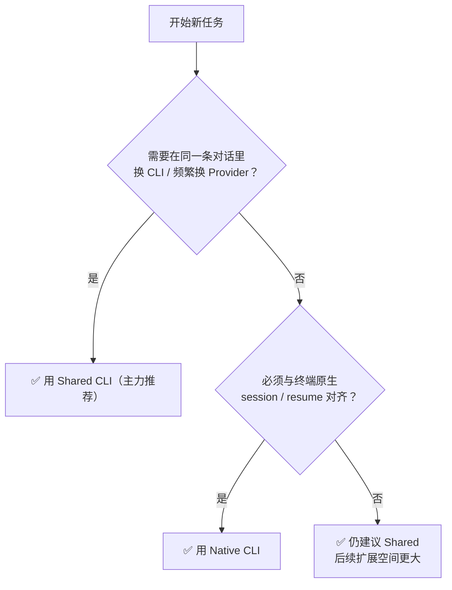

# 第一章 · Shared CLI：一条会话，驾驭所有 CLI

> **系列**：mossx 客户端推广文档 · Chapter 01
> **读者**：正在挑选 AI 编程客户端的开发者、团队决策者
> **事实边界**：本文描述的能力均可回溯至 [Native 与 Shared 契约说明](../analysis/native-vs-shared-cli-explained.md) 与 [多 CLI 会话基石设计](../research/mossx-multi-cli-provider-session-foundation-design.md)

---

## 0. 一句话介绍

**Shared CLI 是 mossx 的主力会话入口：在同一条对话里，随时切换 Claude Code、Codex 等任意 CLI、Provider 与 Model，对话不断线、历史不碎片化。**

你不再需要在多个终端窗口、多个 CLI 的 history 文件之间来回搬运上下文——mossx 帮你管账。

```text
终端时代：  一个 CLI = 一条历史 = 一个孤岛
Shared CLI：一条会话 = 任意 CLI × Provider × Model 自由编排
```

---

## 1. 为什么需要 Shared CLI？

直接用终端跑 `claude` / `codex` 时，你一定会遇到这些时刻：

| 痛点场景 | 终端里的现状 |
|---|---|
| 想对比 Claude 和 Codex 对同一任务的产出 | 开两个窗口，手动复制粘贴上下文 |
| 某个 Provider 额度用尽 / 延迟飙高 | 换 API 配置后，历史往往接不上 |
| 任务做到一半想换更强的模型 | 不同模型在不同 CLI 里，对话被迫中断 |
| 一周后想找「那次对话」 | 散落在多个 CLI 的 history 文件里 |

这些痛点的根源是：**会话身份和历史被绑死在单个 CLI 进程上。**

Shared CLI 的答案：把「会话」从 CLI 手里解放出来，交给 mossx 统一管理。

---

## 2. Shared CLI 的核心能力

### 2.1 一条会话，任意切换 Execution Target

侧栏里永远只有**一条 Shared Session**。你随时可以为「下一轮」指定新的执行目标：

```text
Turn 1  →  Claude Code · 官方 Provider · Opus
Turn 2  →  Codex · 自建网关 · GPT-5
Turn 3  →  Claude Code · OpenRouter · Sonnet
           ↑ 始终是同一条会话，同一份对话血缘
```

- **换 Model**：同 Provider 内直接切
- **换 Provider**：同一会话内改 Target，不新建侧栏会话
- **换 CLI**：受 Shared 支持集合约束，会话依然连续

### 2.2 Canonical 统一记账

所有轮次的对话事实（用户输入、助手输出、工具轨迹）由 mossx 以 **Canonical Fact** 形式统一记账，再投影成聊天 UI：

- 对话血缘完整：不因为换 CLI 而拆成侧栏碎片
- 历史可回溯：一条会话看完整个任务的演进
- 不依赖任何单个 CLI 的 history 文件格式

### 2.3 Context Package：换目标时自动搬运上下文

切换 CLI / Provider 时，mossx 会把当前历史**编译成目标 CLI 能理解的 Context Package** 并投递：

```text
冻结当前历史 → 编译 Context Package → 投递到目标 CLI → 确认后继续
```

- 有损转换（如省略超长工具输出）会**先说明、经你确认**再继续——绝不静默丢上下文
- 看不准时 **fail-closed**：不会自作主张跳到别的 Provider

### 2.4 完整的恢复语义

Shared 会话拥有自己的 recovery 路径：崩溃、中断后按 Shared 语义恢复，不会假装成某个 CLI 的原生 resume 卡片，状态清晰可预期。

---

## 3. Shared CLI 特有功能点清单

以下功能点**仅存在于 Shared 会话**（Native CLI 不提供），均有 OpenSpec 契约背书。这是 Shared 区别于「套壳终端」的核心增量。

| # | 特有功能点 | 它为你做什么 | 契约来源 |
|---|---|---|---|
| 1 | **四级 Execution Target Picker** | 按 CLI → Provider → Model → Reasoning 逐级选择「下一轮谁执行」；Model 目录严格按所选 Provider 作用域过滤，不会混列 | `shared-execution-target` / `shared-session-engine-selection` |
| 2 | **纯选择、零副作用的 Picker** | 在选择器里随便翻看、切换选项，**不会**创建隐藏连接、不会启动任何会话——只有点发送才生效 | `shared-execution-target` |
| 3 | **Next Target 与 Turn Snapshot 分离** | 对话途中改选择器，正在运行的轮次 badge 不变；已完成的轮次归属永远冻结在发送那一刻，事后回看每轮「谁执行的」100% 准确 | `shared-execution-target` |
| 4 | **Turn Badge + 运行时回执** | 每条助手消息带 picker 身份徽章，并即时显示 `→ R {model}` 行内回执，实际执行的模型一目了然（Native 会话不渲染此徽章） | `turn-target-runtime-receipt` |
| 5 | **One Canonical Thread** | 跨 CLI 切换的所有轮次都写进**同一条连续历史**；会话类型创建后不可变，身份跨侧栏 / 标签页 / 重开流程稳定 | `shared-session-thread` |
| 6 | **Hidden Native Bindings** | Shared 内部为每个 Target 维护的原生连接完全藏在幕后；侧栏不会冒出 `MOSSX_CONTEXT_PACKAGE` 之类的协议会话碎片，列表永远干净 | `shared-spawn-sidebar-ownership` / `shared-hide-list-prefilter` |
| 7 | **Context Compiler + Artifact Store** | 上下文包编译结果原子写入、带 checksum 校验；数据不完整时 fail-closed 报类型化错误，绝不把损坏内容投递给目标 CLI | `shared-context-artifact-retrieval` / `shared-context-compiler` |
| 8 | **按 Provider 独立刷新模型目录** | 在选择器里对当前展开的 Provider 单独执行刷新；某个 Provider 刷新失败不影响其他 CLI / Provider 的可用性 | `shared-session-engine-selection` |
| 9 | **Shared 专属 Recovery** | 中断 / 崩溃走 Shared 自己的恢复条与退出闭环语义，不会伪装成某个 CLI 的 native resume 卡片，状态可预期 | `shared-session-recovery-exit-closure`（archived） |
| 10 | **排队消息融合与压缩连续性** | 轮次进行中排队输入的消息在上下文压缩后依然保持连续，不会因 compaction 丢失排队内容 | `restore-shared-queue-fusion-compaction-continuity`（archived） |

> **一句话总结**：Native 给你「一个 CLI 的原生体验」，Shared 在此之上额外给你**编排层**——可观测（badge / 回执）、可切换（四级 picker）、可信赖（snapshot 冻结、fail-closed、专属 recovery）。

> **路线预告（开发中，非 shipped）**：Shared 会话的 Project Memory 自动捕获（`add-shared-session-project-memory-capture`）与多代理 Squad 编排（`add-shared-squad-control-plane`）正在推进，落地后会单独更新本章。

---

## 4. Shared CLI vs Native CLI：全维度对比

mossx 同时提供两种会话模型。**它们不是新旧替代关系，而是两种互补的产品路径。**

| 维度 | **Shared CLI**（主力入口） | **Native CLI**（原生路径） |
|---|---|---|
| **定位** | 多 CLI 编排基石，一条会话走全程 | 单一 CLI 的原生语义，与终端对齐 |
| **会话数量** | 始终 1 条，任意切换 | 1 条 = 1 个原生会话；供应商续接会派生新会话 |
| **换 Model（同 Provider）** | 会话内直接切换 | 会话内直接切换 |
| **换 Provider（同 CLI）** | **同一会话内**改 Target | **供应商续接**：原会话不动，派生带上下文的新会话 |
| **换 CLI** | ✅ 支持（受支持集合约束） | ❌ 不支持在同一原生会话内换 |
| **历史归属** | mossx Canonical 统一记账 | 该 CLI 自己的原生 history |
| **与终端互通** | 弱（主账本在 mossx 侧） | 强（与终端 resume / history 完全对齐） |
| **崩溃恢复** | Shared recovery 语义 | 该 CLI 的 native runtime recovery |
| **典型入口** | 侧栏 Shared CLI 入口 | 选具体引擎 / 供应商创建 |

### 一张图看懂关系

```text
                    ┌─────────────────────────┐
                    │       mossx 客户端       │
                    └───────────┬─────────────┘
              ┌─────────────────┴─────────────────┐
              ▼                                   ▼
     ┌────────────────┐                 ┌────────────────────┐
     │   Shared CLI   │  主力入口        │    Native CLI      │
     │  任意切换编排   │                 │  单 CLI 原生语义    │
     │  Canonical 记账 │                 │  + 供应商续接       │
     └────────┬───────┘                 └─────────┬──────────┘
              │      内部为每个 Target 建立隐藏 Binding │
              └─────────────────┬─────────────────┘
                                ▼
              ┌──────────────────────────────────┐
              │   本机 CLI 进程（Claude / Codex / …）│
              │   真正干活的仍是你信任的 CLI        │
              └──────────────────────────────────┘
```

**关键认知**：Shared CLI 不是绕开 CLI 自己造 Agent，而是在你本机的 CLI 之上做**编排与上下文同步**——权限、工具、MCP 等能力依然来自各个 CLI 本身。

---

## 5. 三个典型场景

### 场景一：多模型对比，一条会话搞定

> 「这个重构方案，Claude 和 Codex 谁的更靠谱？」

开一条 Shared Session，同一轮问题分别交给两个 CLI 执行，回答按时间线排在同一条对话里。不用开两个终端、不用复制粘贴需求描述。

### 场景二：Provider 出状况，秒换通道继续聊

> 「官方 API 又 429 了，任务正做到一半。」

直接把下一轮的 Target 改到备用 Provider（自建网关 / OpenRouter），对话在同一条会话里继续。mossx 负责把历史打包成新通道能吃的上下文。

### 场景三：额度精细调度，按任务选模型

> 「简单问答用便宜模型，关键架构决策上旗舰模型。」

每一轮都可以是不同的 Model 组合，对话血缘保持完整——一周后回看，依然是一条清晰的任务主线。

---

## 6. 什么时候该选 Native CLI？

Shared 是默认推荐，但以下情况 Native 更合适：



- **深度依赖某 CLI 的原生能力**（特定的 resume / fork / 终端互通工作流）→ Native
- **中途只想换同 CLI 的 Provider** → Native 的「供应商续接」：原会话保持不动，派生一条带完整上下文的续接会话，来源关系清晰可见
- **其他一切情况** → Shared

---

## 7. 诚实的边界说明

推广也要讲清楚成本，Shared CLI 的两个固有特性：

1. **切换时需要「准备上下文」**。mossx 调用的是本机 CLI 进程而不是云端 SDK，换 Target 不是改一个 API 字段，而是把历史翻译成目标 CLI 能理解的协议。大历史、跨 CLI 切换时会有可感知的准备时间——这是架构选择换来的（你获得了各 CLI 的原生工具能力），不是性能缺陷。
2. **有损转换需要你的确认**。当目标 CLI 的上下文窗口或能力吃不下完整历史时，mossx 会明确列出省略项并请你确认，绝不静默丢弃。需要完整工具轨迹的任务，建议减少跨 CLI 切换次数。

---

## 8. 术语速查

| 术语 | 含义 |
|---|---|
| **CLI / Engine** | 本机执行 Agent 的程序：Claude Code、Codex 等 |
| **Provider** | CLI 使用的 API 渠道配置（官方 / OpenRouter / 自建网关等） |
| **Execution Target** | 「下一轮谁执行」的完整描述：CLI + Provider + Model + Reasoning |
| **Shared Session** | mossx 管理的共享会话：用户侧一条，内部可多 Target |
| **Canonical Fact** | Shared 会话的统一记账流水，投影成聊天 UI |
| **Context Package** | 切换 Target 时打包、适配后的历史上下文 |
| **供应商续接** | Native 路径：从来源会话派生到新 Provider 的独立会话 |

---

## 9. 延伸阅读

| 文档 | 适合谁读 |
|---|---|
| [Native 与 Shared CLI 契约说明](../analysis/native-vs-shared-cli-explained.md) | 想深入技术契约与决策树的进阶用户 |
| [多 CLI 会话基石设计](../research/mossx-multi-cli-provider-session-foundation-design.md) | 想了解架构 ADR 的工程师 |

---

## 变更记录

| 日期 | 说明 |
|---|---|
| 2026-08-24 | 初版：Shared CLI 能力卖点 + 与 Native CLI 全维度对比，作为推广系列第一章 |
| 2026-08-24 | 补充 §3「Shared CLI 特有功能点清单」（10 项 Shared-only 能力，逐项标注 OpenSpec 契约来源），后续章节顺延编号 |
